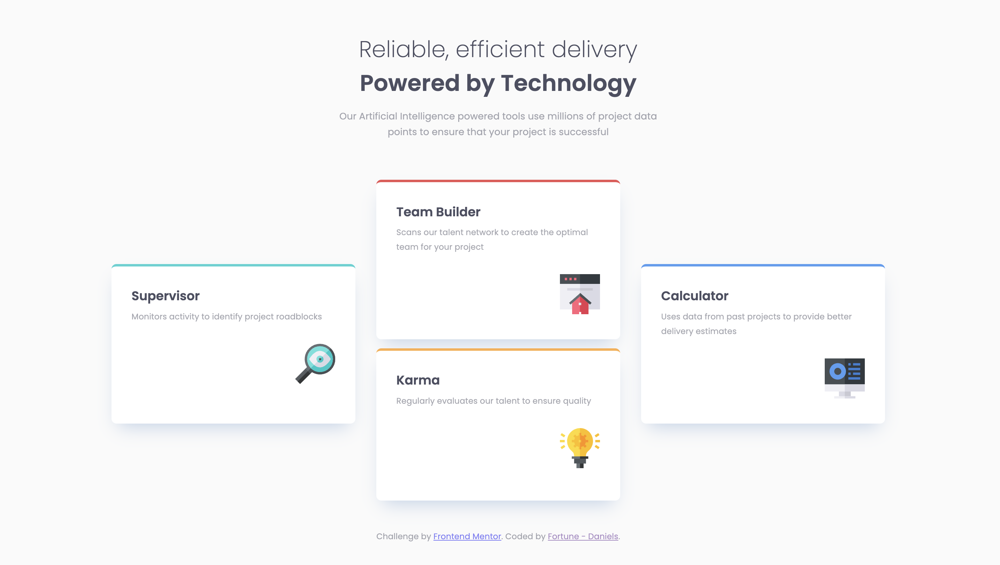
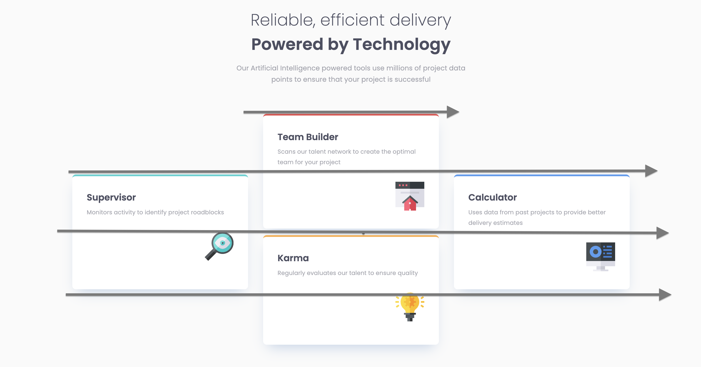

# Frontend Mentor - Four card feature section solution

This is a solution to the [Four card feature section challenge on Frontend Mentor](https://www.frontendmentor.io/challenges/four-card-feature-section-weK1eFYK). Frontend Mentor challenges help you improve your coding skills by building realistic projects. 

## Table of contents
  - [The challenge](#the-challenge)
  - [Screenshot](#screenshot)
  - [Links](#links)
- [My process](#my-process)
  - [Built with](#built-with)
  - [What I learned](#what-i-learned)
  - [Useful resources](#useful-resources)
- [Author](#author)

## Overview

### The challenge

Users should be able to:

- View the optimal layout for the site depending on their device's screen size

### Screenshot

### Links

- Solution URL: [GitHub Repository](https://github.com/DAJ350/four-card-feature-section-master)
- Live Site URL: [GitHub Pages](https://daj350.github.io/four-card-feature-section-master/)

## My process

For this project, I firstly set off to learn the BEM naming convention in attempt to improve how organised and scalable my code is. This is a practice I intend to uphold moving forward. I then began editing the HTML document to add the semantic elements. 

Once I completed with the structuring of the page, I moved into creating the colour variables and typography classes. I then went on to creating the layout of the overall body of the page. I noticed that the design puts all of the content within the middle section of the page with equal gaps on either side. I could have achieved this look by using the margin property in the body element but I wanted to practice my use of grids. Bearing this in mind, I went ahead to create a main grid layout and set the main content to be positioned within the middle column.

I then started with styling the main content of the page. Creating the card component in a way that would allow for it to be reused or scaled if I was to return to this project in the future. 

### Built with

- Semantic HTML5 markup
- CSS custom properties
- Flexbox
- CSS Grid
- BEM 

### What I learned

I learned a number of things while creating this page. Firstly I learned about using the BEM naming convention which is a great tool to creating better, readable, manageable and scalable code. 

I also revisited my knowledge of CSS Grids. I found the implementation of an accurate grid quite challenging as this is my first time actually putting it into practice. I found the most challenge in setting up the correct amount of rows and columns based on the design provided. After tinkering with it for a few hours, I finally learned a method I can use moving forward to easily figure out how many rows or columns I need in the grid in order to achieve the design. 

Method:
Calculating Number of Required Columns:
- Count how many columns there are within the entire layout starting from the left side of the layout moving to the right.
- If counting a line inbetween a gutter, count both the line of the left side of the element and the line of the right side of the following element, as one column. 

Calculating number of required rows (if found this one most difficult):
- Starting for the top of the layout, count the number of horizontal lines there are. This count should include both the top line (border-top) of and element and the bottom line (border-bottom) of the element. 

I also was reminded during this project how using percentages are a great way to set the width or height of element if you want the size to scale with the total available space on the viewport. 

Rems and Ems are great for adjusting properties that are text related. 

### Useful resources

- [BEM Tutorial by Kevin Geary](https://youtu.be/tha_ynmZRaA?si=xf3Kf6DMM6OcC-NN) - This helped me learn the basics of BEM. He provides a solid example of what not to do and how to correctly use the BEM naming convention.
- [Coder Coder Builds Building a Product Landing Page](https://youtu.be/ZiXkYiI7LoI?si=xLkE-YSHiLOcae0g) - Watching this video, I was inspired by how she used grid to construct the overall layout of the page. This is where I got the concept from to set up the overall layout of this project. 

## Author

- GitHub - [DAJ350](https://github.com/DAJ350)
- Frontend Mentor - [@DAJ350](https://www.frontendmentor.io/profile/DAJ350)
